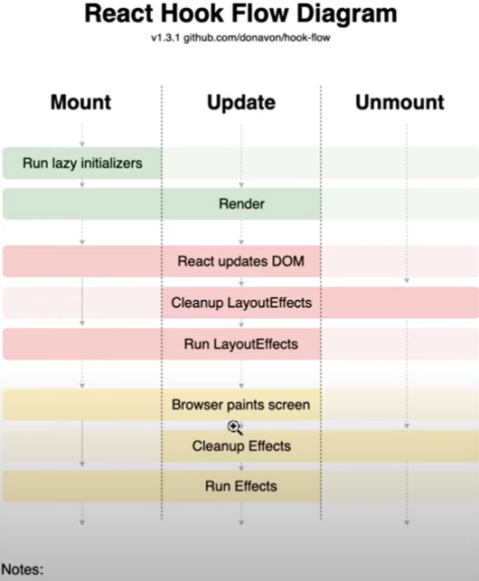

# useLayoutEffect



## useEffect

render => browser paints screen => useEffect 발동

### useState의 변화 과정

1. render -> 처음에는 빈값으로 초기화되어있어, 빈값으로 렌더링
2. paint -> 빈 칸 이었을 때, 페인트
3. useEffect로 setState가 되면서
4. rerender -> 바뀐 값으로 렌더링
5. repaint -> 깜빡이는 현상 발생

위의 과정으로 순간적인 깜빡임 현상이 발생하는 것

## useLayoutEffect

화면을 그리기(paint)전에 useLayoutEffect가 발동되어 바뀐 값으로 바로 페인팅 되어, 깜빡임이 없음

=> state 업데이트로 화면 깜빡임이 생길때, useLayoutEffect를 사용함

# useTransition

바로 업데이트 되어야할 것과 나중에 업데이트 되어야할 것을 구분해주는 훅이다.

```javascript
const [loading, startTransition] = useTransition();
```

중요도가 떨어지거나 뒤로 미뤄도 되는 값들을 startTranstion으로 감싸서 바꿔준다.

```javascript
const onChange = useCallback((e) => {
  setName(e.target.value);
  startTransition(() => {
    e.target.value + "의 결과";
  });
}, []);
```

loading은 startTranstion에서의 잠깐의 텀에서 loading이 true가 되어 따로 로딩 화면을 보여줄 수 있다.

# useDeferredValue

덜 중요한 값들을 useDeferredValue로 선언하여, React가 업데이트를 천천히 해준다.

```javascript
const deferredName = useDeferredValue(name);
const result = useMemo(() => deferredName + "의 결과", [deferredName]);
```
