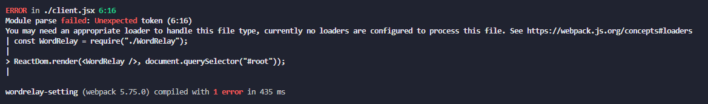

# 2. 끝말잇기

## 웹팩 설치하기

- 웹팩을 쓰는 이유
  실무에서는 컴포넌트가 여러가지로 구축되어있다.
  -> 유지보수가 힘들다.

여러개의 자바스크립트 파일들을 하나로 합쳐서, 리소스들을 최적화할 수 있다.

### 설치하기

1. `npm init` -> package.json 생성
2. `npm i react react-dom`
3. `npm i -D webpack webpack-cli`

## 모듈 시스템과 웹팩 설정

우리가 만든 `client.jsx` 와 `WorkRelay.jsx`를 아래의 script 태그와 같이 하나로 합쳐야 html이 인식 가능하게 된다.

이때, 웹팩이 두 파일을 하나로 합쳐주는 역할을 한다.

`webpack.config.js`내에서 설정한다.

### webpack.config.js

webpack은 client.jsx가 WordRelay.jsx를 불러오는 것을 알고 있으므로 entry에 추가할 필요가 없다.

resolve의 extensions속성을 통해, 각 파일들의 확장자명을 webpack이 대신 확인해주므로 확장자를 따로 쓸 필요 없다.

```javascript
module.exports = {
  name: "wordrelay-setting",
  mode: "development", // 실서비스 : production
  devtool: "eval", // 빠르게
  resolve: {
    extensions: [".js", ".jsx"],
  },
  entry: {
    app: ["./client"], // 배열로 넣음
  }, // 입력 -> client, WordRelay
  output: {
    // 현재 폴더(__dirname) 안에 "dist"를 자동으로 생성
    path: path.join(__dirname, "dist"),
    // 출력파일명
    filename: "app.js",
  }, // 출력 -> app.js의 출력 장소
};
```

### webpack 설정 적용하기

아래의 3가지 방법 중 하나로 적용하기

1. 명령어 webpack 적용하기
2. scripts에 명령어 추가하기
3. `npx webpack`

### webpack error handling


원인은 JSX문법을 이해하지 못해서 일어나는 문법
-> JSX는 자바스크립트 문법이 아니다. 그래서 webpack에서 babel을 추가하고, jsx를 추가 저정해줘야한다.

`npm i -D @babel/preset-env`

babel/preset-env가 우리 각자의 브라우저에 맞게 최선 문법을 옛날 문법으로 변환해준다.

`npm i -D @babel/preset-react`

react를 지원해준다.

`npm i -D babel-loader`

babel이랑 webpack을 연결해준다.

`webpack.config.js`의 `module` 속성에 추가

## @babel/preset-env과 plugins

- preset : plugin들의 모음
- preset-env : 자동으로 옛날 브라우저들 지원
  - 구체적으로 어떤 브라우저를 지원할 것인지 설정(targets/browers)
  - 하단의 코드와 같이 preset-env의 특정 설정을 위해 배열 내 객체 형태로 속성 추가 -`https://github.com/browserslist/browserslist`참고
  ```javascript
   module: {
    rules: [
      {
        test: /\.jsx?$/,
        loader: "babel-loader",
        options: {
          presets: [
            [
              "@babel/preset-env",
              {
                targets: {
                  browsers: ["last 2 chrome versions"],
                },
                debug:true,
              },
            ],
            "@babel/preset-react",
          ],
          // LoaderOptionsPlugin -> loader의 모든 옵션들에 해당하는 것들을 다 디버깅하도록 하는 설정
          plugins: [new webpackConfig.LoaderOptionsPlugin({ debug: true })],
        },
      },
    ],
  ```

## 웹팩 데브 서버와 핫 리로딩

- `npm i react-refresh @pmmmwh/react-refresh-webpack-plugin -D`

- 개발용 웹팩 데브서버 설치 :
  `npm i -D webpack-dev-server`

- script 명령어 속성 변경 : webpack -> webpack serve --env development
  - webpack cli가 4버전 이상부터는 변경됨
- plugins: [new RefreshWebpackPlugin()] 장착
- babel loader에 react-refresh/babel plugin 장착
  (babel이 핫리로딩 기능까지 추가해준다.)
- devServer 추가

```javascript
  devServer: {
    // 결과물을 dist 에 저장해주고, 소스코드에 변경사항이 있을 때마다 결과물에 수정 내역을 반영해준다(hot reloading)
    // webpack devserver가 생성해주는 결과물이 저장되는 경로
    devMiddleware: { publicPath: "/dist" },
    // index.html과 같이 실제 정적 파일이 존재하는 경로를 static에 넣는다.
    static: { directory: path.resolve(__dirname) },
    hot: true,
  },
```

위의 과정이 없어도 react가 reloading을 시켜줌(새로고침)

그러나, **새로고침을 하면 기존 데이터가 다 날아가지만, hot reloading은 기존 데이터를 유지하면서 새로고침을 해준다.**

## 컨트롤드 인풋 vs 언컨트롤드 인풋

React에서는 컨트롤드 인풋을 더 권장한다.

onChange로 value를 직접 컨트롤 하는 구조

```javascript
// 컨롤롤드 인풋
<input
  ref={inputEl}
  value={value}
  onChange={(e) => setValue(e.currentTarget.value)}
/>

// 언컨트롤드 인풋
<input ref={inputEl} />
```

- 언컨트롤드 인풋

1. one-time value retrieval : submit 안에서만 쓰이는 경우
2. validating on submit
   value 값을 onSubmit 안에서만 쓰는 경우에는 ref로만 접근하여 value를 대체할 수 있음

언컨트롤드 인풋에 초기값을 넣고 싶다면, value가 아닌 **defaultValue** 속성에 넣는다.(value는 컨트롤드 인풋으로 간주될 수 있음)

```javascript
const onSubmitForm = (e) => {
  e.preventDefault();
  if (word[word.length - 1] === e.target.children.word.value[0]) {
    e.target.children.word = "";
    inputEl.current.focus();
  }
};

return (
  <>
    <form onSubmit={onSubmitForm}>
      <input id="word" ref={inputEl} defaultValue="초기값" />
      <button></button>
    </form>
  </>
);
```

- 컨롤롤드 인풋

1. one-time value retrieval
2. validating on submit
3. dynamic inputs : 비밀번호 8자 이상인데, 그 미만일시 빨간 표시
4. conditionally disabling submit button : 비밀번호 8자 이상인데, 4자만 적은 경우 버튼 제출 못하게 막는 기능
5. enforcing input format : 비밀번호 형식 강제하기
6. several inputs for one piece of data : 하나의 스테이트로 여러 input ref들을 관리할 수 있다.
7. instant field validation : 유효성 검사
